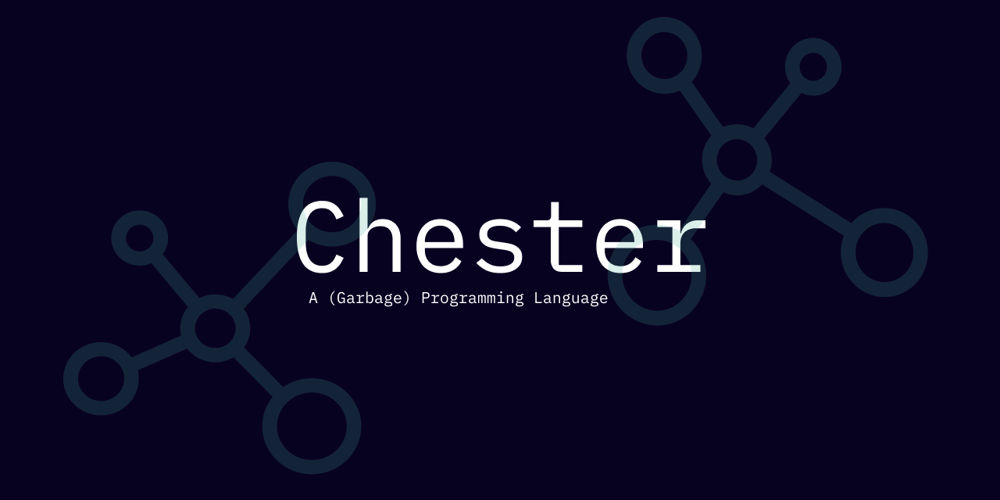

<br />

# Chester: A Simple Programming Language

Chester is a hobbyist programming language designed for simplicity and experimentation. It's an interpreted language, meaning code is executed line by line, making it easy to debug and understand. This project is a playground for exploring language design concepts, interpreter implementation, and the joy of creating something from scratch.

## Features

-   **Simple Syntax:** Chester aims for a clean and intuitive syntax, borrowing ideas from languages like Python and JavaScript.
-   **Dynamic Typing:** Variable types are checked during runtime, offering flexibility and ease of use.
-   **Basic Data Types:** Supports numbers, strings, and lists as fundamental data types.
-   **Functions:** Define and call your own functions to create reusable code blocks.
-   **Built-in Functions:** Includes a set of built-in functions for common tasks like printing, input, and list manipulation.
-   **REPL (Read-Eval-Print Loop):** An interactive environment for experimenting with Chester code.

## Getting Started

### Prerequisites

-   **Node.js:** Chester is implemented in TypeScript and requires Node.js to run. Download and install it from [https://nodejs.org/](https://nodejs.org/).
-   **TypeScript:** You'll need the TypeScript compiler to build the project. Install it globally using npm:

    ```bash
    npm install -g typescript
    ```

-   **ts-node:** To run the REPL directly, install `ts-node` globally:

    ```bash
    npm install -g ts-node
    ```

### Installation

1.  **Clone the Repository:**

    ```bash
    git clone https://github.com/AdityaBhattacharya1/Chester
    cd chester
    ```

2.  **Install Dependencies:**

    ```bash
    npm install
    ```

3.  **Build the Project:**

    ```bash
    npm run build
    ```

### Running the REPL

To start the interactive REPL, use the following command:

```bash
ts-node shell.ts
```

## Language Syntax

### Variables

Variables are declared using the `let` keyword:

```chester
let x = 10
let name = "Chester"
```

### Data Types

-   **Numbers:** Integers and floating-point numbers.

    ```chester
    let age = 30
    let price = 99.99
    ```

-   **Strings:** Text enclosed in double quotes.

    ```chester
    let message = "Hello, world!"
    ```

-   **Lists:** Ordered collections of values enclosed in square brackets.

    ```chester
    let numbers = [1, 2, 3, 4, 5]
    let fruits = ["apple", "banana", "orange"]
    ```

### Operators

Chester supports the following operators:

-   **Arithmetic:** `+`, `-`, `*`, `/`
-   **Comparison:** `==`, `!=`, `>`, `<`, `>=`, `<=`
-   **Logical:** `and`, `or`, `not`

### Control Flow

-   **If Statements:**

    ```chester
    let age = 20
    if (age >= 18) then
        print("You are an adult")
    else
        print("You are a minor")
    end
    ```

-   **For Loops:**

    ```chester
    let numbers = [1, 2, 3]
    for i = 0 to length(numbers) then
        print(numbers/i)
    end
    ```

### Functions

Functions are defined using the `func` keyword:

```chester
func add(x, y)
    return x + y
end

let sum = add(5, 3)
print(sum)  # Output: 8
```

### Built-in Functions

-   **`print(value)`:** Prints the value to the console.
-   **`length(list)`:** Returns the length of a list.
-   **`append(list, value)`:** Appends a value to the end of a list.
-   **`input()`:** Reads a line of text from the user.
-   **`inputInt()`:** Reads an integer from the user.

## Examples

### Hello, World!

```chester
print("Hello, world!")
```

### Calculating Factorial

```chester
func factorial(n)
    if (n <= 1) then
        return 1
    else
        return n * factorial(n - 1)
    end
end

let result = factorial(5)
print(result)  # Output: 120
```

### List Manipulation

```chester
let numbers = [1, 2, 3]
append(numbers, 4)
print(numbers)  # Output: [1, 2, 3, 4]
print(length(numbers))  # Output: 4
```

## Contributing

Chester is an open-source project, and contributions are welcome! If you'd like to contribute, please follow these steps:

1.  Fork the repository.
2.  Create a new branch for your feature or bug fix.
3.  Implement your changes.
4.  Write tests to ensure your changes are working correctly.
5.  Submit a pull request.

## Future Enhancements

-   More data types (e.g., booleans, dictionaries).
-   Error handling and exception management.
-   More built-in functions.
-   A standard library.
-   Improved performance.
